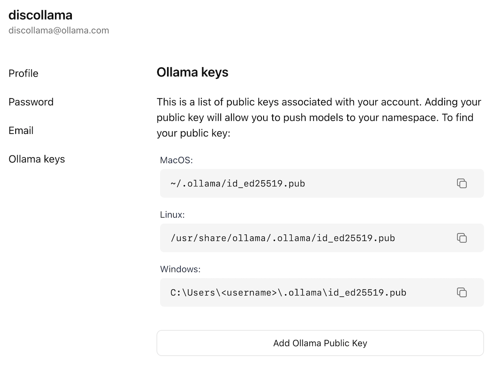

> 🌐 本文档由 [ollama/ollama](https://github.com/ollama/ollama) 翻译,英文原版见原项目。

## 目录

- [导入 Safetensors 适配器](#从-safetensors-权重导入微调适配器)
- [导入 Safetensors 模型](#从-safetensors-权重导入模型)
- [导入 GGUF 文件](#导入基于-gguf-的模型或适配器)
- [在 ollama.com 上分享模型](#在-ollamacom-上分享你的模型)

## 从 Safetensors 权重导入微调适配器

首先,创建一个 `Modelfile`,其中 `FROM` 命令指向你微调时使用的基座模型,`ADAPTER` 命令指向存放 Safetensors 适配器的目录:

```dockerfile
FROM <base model name>
ADAPTER /path/to/safetensors/adapter/directory
```

注意:`FROM` 命令中的基座模型必须与你创建适配器时使用的基座模型一致,否则结果会很不稳定。大多数框架使用的量化方法各不相同,因此最好使用非量化(即非 QLoRA)的适配器。如果你的适配器与 `Modelfile` 在同一目录,可用 `ADAPTER .` 指定适配器路径。

然后在创建 `Modelfile` 的目录中运行 `ollama create`:

```shell
ollama create my-model
```

最后,测试模型:

```shell
ollama run my-model
```

Ollama 支持导入基于多种模型架构的适配器,包括:

- Llama(包括 Llama 2、Llama 3、Llama 3.1 和 Llama 3.2);
- Mistral(包括 Mistral 1、Mistral 2 和 Mixtral);
- Gemma(包括 Gemma 1 和 Gemma 2)

你可以使用任何能输出 Safetensors 格式适配器的微调框架或工具来创建适配器,例如:

- Hugging Face [微调框架](https://huggingface.co/docs/transformers/en/training)
- [Unsloth](https://github.com/unslothai/unsloth)
- [MLX](https://github.com/ml-explore/mlx)

## 从 Safetensors 权重导入模型

首先,创建一个 `Modelfile`,`FROM` 命令指向存放 Safetensors 权重的目录:

```dockerfile
FROM /path/to/safetensors/directory
```

如果 Modelfile 与权重放在同一目录,可以直接用 `FROM .`。

然后在创建 `Modelfile` 的目录中运行 `ollama create` 命令:

```shell
ollama create my-model
```

最后,测试模型:

```shell
ollama run my-model
```

Ollama 支持导入多种架构的模型,包括:

- Llama(包括 Llama 2、Llama 3、Llama 3.1 和 Llama 3.2);
- Mistral(包括 Mistral 1、Mistral 2 和 Mixtral);
- Gemma(包括 Gemma 1 和 Gemma 2);
- Phi3

既包括基础模型,也包括已与基础模型_合并(fuse)_的微调模型。

## 导入基于 GGUF 的模型或适配器

如果你手上有基于 GGUF 的模型或适配器,可以导入 Ollama。获取 GGUF 模型或适配器的途径:

- 用 Llama.cpp 的 `convert_hf_to_gguf.py` 转换 Safetensors 模型;
- 用 Llama.cpp 的 `convert_lora_to_gguf.py` 转换 Safetensors 适配器;或
- 从 HuggingFace 之类的平台下载模型或适配器

导入 GGUF 模型时,创建一个包含以下内容的 `Modelfile`:

```dockerfile
FROM /path/to/file.gguf
```

导入 GGUF 适配器时,`Modelfile` 写作:

```dockerfile
FROM <model name>
ADAPTER /path/to/file.gguf
```

导入 GGUF 适配器时,基座模型必须与创建适配器时使用的基座模型一致。你可以使用:

- Ollama 中的模型
- 一个 GGUF 文件
- 一个基于 Safetensors 的模型

创建好 `Modelfile` 后,使用 `ollama create` 命令构建模型。

```shell
ollama create my-model
```

## 量化模型

量化模型可以让你跑得更快、占用内存更少,但精度会有所下降。这让你能在更普通的硬件上运行模型。

Ollama 可以通过 `ollama create` 命令的 `-q/--quantize` 参数,把 FP16 和 FP32 模型量化到不同的量化等级。

首先,创建一个指向你想量化的 FP16 或 FP32 模型的 Modelfile。

```dockerfile
FROM /path/to/my/gemma/f16/model
```

然后用 `ollama create` 创建量化模型。

```shell
$ ollama create --quantize q4_K_M mymodel
transferring model data
quantizing F16 model to Q4_K_M
creating new layer sha256:735e246cc1abfd06e9cdcf95504d6789a6cd1ad7577108a70d9902fef503c1bd
creating new layer sha256:0853f0ad24e5865173bbf9ffcc7b0f5d56b66fd690ab1009867e45e7d2c4db0f
writing manifest
success
```

### 支持的量化等级

- `q8_0`

#### K-means 量化

- `q4_K_S`
- `q4_K_M`

## 在 ollama.com 上分享你的模型

你可以把创建的任何模型推送到 [ollama.com](https://ollama.com),让其他用户试用。

首先,用浏览器打开 [Ollama 注册](https://ollama.com/signup)页面。如果你已有账号,可跳过此步骤。


`Username` 字段会成为你模型名称的一部分(例如 `jmorganca/mymodel`),所以请确保你对自己选择的用户名满意。

创建账号并登录后,前往 [Ollama Keys 设置](https://ollama.com/settings/keys)页面。

按照页面指引找到你的 Ollama 公钥所在位置。



点击 `Add Ollama Public Key` 按钮,把你的 Ollama 公钥内容复制粘贴到文本框中。

要把模型推送到 [ollama.com](https://ollama.com),先确保模型名称带有你的用户名前缀。可能需要用 `ollama cp` 命令复制一份模型来获得正确的名称。名称确认无误后,使用 `ollama push` 命令把模型推送到 [ollama.com](https://ollama.com)。

```shell
ollama cp mymodel myuser/mymodel
ollama push myuser/mymodel
```

推送完成后,其他用户就可以用以下命令拉取并运行你的模型:

```shell
ollama run myuser/mymodel
```
